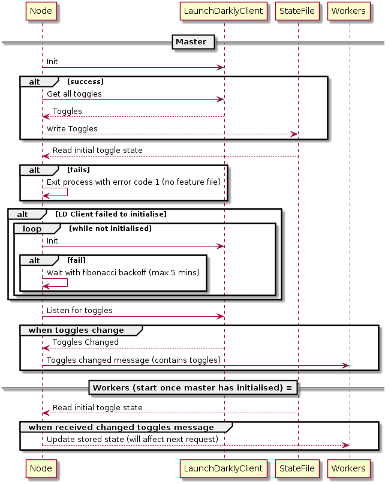

# Etrigan feature toggles

The feature toggling support in etrigan is designed to work ontop of a clustering approach like https://github.com/JakeGinnivan/gru.

The master will create the feature-updater, this process takes care of trying to connect to launch darkly (though with not too much effort it could be pluggable) then fetch the initial state.

It will then write those features to a feature state file, which is used in the event launch darkly cannot be contacted during service start.

When the worker starts it will read it's state from the feature file. Whenever the master updates it's state (due to a config change in launch darkly) it will send a message to all workers telling them to update their features.

## Features

### Master/Worker support

Rather than all the workers fetching their own toggle state, the master subscribes to launch darkly and tells the workers to update whenever the feature state changes.

### Express middleware

Features will never change during a request, instead will take effect from the next request after they change.

### Last known good configuration fallback

By writing the last known feature state to a file, if your service restarts/crashes and it cannot contact LaunchDarkly for any reason, your service can still start.

## Usage

```ts
import { gru } from 'node-gru'
import {
    createFeatureUpdater,
    createFeatureReceiver,
    createFeatureStateMiddleware,
    isFeatureEnabled,
} from '@etrigan/feature-toggles'

gru({
    master: async () => {
        // In the master process we subscribe to toggle changes
        // and they will be written to the feature state file.
        await createFeatureUpdater(logger, {
            featureStateFile: './test-features.json',
            launchDarklySdkKey: 'SDK-KEY',
        })
    },
    start: async () => {
        // Create express app

        app.use(
            createFeatureStateMiddleware(
                await createFeatureReceiver(logger, config.featureStateFile),
            ),
        )

        app.use(req => {
            if (isFeatureEnabled(req.features, 'my-feature')) {
            }
        })
    },
})
```

### Startup



#### When feature state file cannot be found, and launch darkly is down or turned off

```
2017-10-06T08:11:20.973Z] ERROR: The West/85233 on itmbloan02: Failed to initialise server
    Error: Expecting feature state file to exist at /Users/jakeg/_code/the-west/development-features.json
        at Object.<anonymous> (/Users/jakeg/_code/the-west/build/server/webpack:/server/index.ts:105:1)
        at step (/Users/jakeg/_code/the-west/build/server/server.js:6343:23)
        at Object.next (/Users/jakeg/_code/the-west/build/server/server.js:6324:53)
        at fulfilled (/Users/jakeg/_code/the-west/build/server/server.js:6315:58)
        at process._tickCallback (internal/process/next_tick.js:109:7)
        at Module.runMain (module.js:606:11)
        at run (bootstrap_node.js:389:7)
        at startup (bootstrap_node.js:149:9)
        at bootstrap_node.js:502:3
```

#### Normal server startup

```
[2017-10-06T09:30:21.982Z] DEBUG: The West/90811 on itmbloan02: Initialising launch darkly client with key sdk-7feee601-098b-4d2f-9874-695a6e2645db
[2017-10-06T09:30:21.985Z]  INFO: The West/90811 on itmbloan02: [LaunchDarkly] Initializing stream processor to receive feature flag updates
[2017-10-06T09:30:23.221Z] DEBUG: The West/90811 on itmbloan02: [LaunchDarkly] Received put event
[2017-10-06T09:30:23.227Z]  INFO: The West/90811 on itmbloan02: Launch darkly client initialised with features: {"meta_description_from_content":{"enabled":true,"canClientOverride":false},"outbrain":{"enabled":true,"canClientOverride":false},"ramp_ads":{"enabled":true,"canClientOverride":false},"gemini_native_advertising":{"enabled":true,"canClientOverride":false},"gemini_native_advertising_placeholders":{"enabled":false,"canClientOverride":false},"article_content_mrec":{"enabled":true,"canClientOverride":false},"article_teads":{"enabled":false,"canClientOverride":false},"article_teads_inline":{"enabled":false,"canClientOverride":false},"branded_content":{"enabled":true,"canClientOverride":false},"hero_video_sticky":{"enabled":true,"canClientOverride":false},"hero_video_pause_ad":{"enabled":true,"canClientOverride":false},"inline_video_cards":{"enabled":true,"canClientOverride":false},"weather_widget":{"enabled":true,"canClientOverride":false},"weather_sponsor":{"enabled":false,"canClientOverride":false},"seven_news_branding_home":{"enabled":true,"canClientOverride":false},"seven_news_branding_article":{"enabled":true,"canClientOverride":false},"google_tag_manager":{"enabled":true,"canClientOverride":false},"nabo_widget":{"enabled":true,"canClientOverride":false},"nielsen_events":{"enabled":true,"canClientOverride":false},"auto_refresh":{"enabled":true,"canClientOverride":false},"ad_lazy_loading_test":{"enabled":false,"canClientOverride":false},"ad_skins":{"enabled":true,"canClientOverride":false},"gpt_ads":{"enabled":true,"canClientOverride":false},"brightcove_player":{"enabled":true,"canClientOverride":false}}
[2017-10-06T09:30:23.227Z] DEBUG: The West/90811 on itmbloan02: Sending flag event {"key":"server-side-render","kind":"identify","user":{"key":"server-side-render"},"creationDate":1507282223227}
[2017-10-06T09:30:23.229Z] DEBUG: The West/90811 on itmbloan02: Writing feature state file to /Users/jakeg/_code/the-west/development-features.json
[2017-10-06T09:30:23.231Z] DEBUG: The West/90811 on itmbloan02: Reading features from /Users/jakeg/_code/the-west/development-features.json
[2017-10-06T09:30:23.233Z]  INFO: The West/90811 on itmbloan02: Server starting in clustered mode with 1
[2017-10-06T09:30:23.234Z]  INFO: The West/90811 on itmbloan02: Starting server
[2017-10-06T09:30:24.682Z] DEBUG: The West/90799 on itmbloan02: Flushing 1 events
Worker Logs
[2017-10-06T09:47:58.990Z] DEBUG: The West/91473 on itmbloan02: Reading features from /Users/jakeg/_code/the-west/development-features.json
[2017-10-06T09:47:58.995Z]  INFO: The West/91473 on itmbloan02: Starting server
...
[2017-10-06T09:48:26.046Z] DEBUG: The West/91465 on itmbloan02: [LaunchDarkly] Received patch event
[2017-10-06T09:48:26.058Z] DEBUG: The West/91465 on itmbloan02: Writing feature state file to /Users/jakeg/_code/the-west/development-features.json
[2017-10-06T09:48:48.903Z] DEBUG: The West/91465 on itmbloan02: [LaunchDarkly] Received patch event
[2017-10-06T09:48:48.905Z] DEBUG: The West/91465 on itmbloan02: Writing feature state file to /Users/jakeg/_code/the-west/development-features.json
[2017-10-06T09:48:59.480Z] DEBUG: The West/91465 on itmbloan02: [LaunchDarkly] Received patch event
[2017-10-06T09:48:59.486Z] DEBUG: The West/91465 on itmbloan02: Writing feature state file to /Users/jakeg/_code/the-west/development-features.json
```
